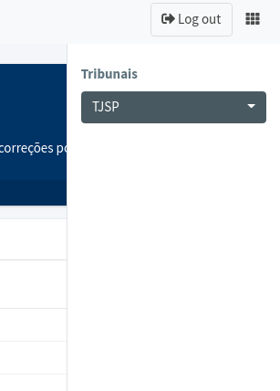

# inovaCNJ

A plataforma `{inovaCNJ}` foi elaborada para resolver duas dores:

1)  Inconsistências precisam ser monitoradas continuamente.

2)  O trabalho de arrumar dados precisa ser distribuído nos tribunais / unidades judiciárias.

Por isso, construímos um *dashboard* interativo que, além de mostrar as principais inconsistências e comparar o desempenho dos tribunais, também permite o envio de tabelas arrumadas para validação do CNJ.

A plataforma mostra inconsistências identificadas através de regras e ou modelagem estatística. Até o momento, foram implementadas mais de 15 regras, a partir de uma amostra de 100 mil processos, extraída aleatoriamente da base fornecida para este desafio.

Uma parte das inconsistências já tem uma **proposta de** **solução** para o problema, sendo necessário apenas a verificação das sugestões. Outra parte das inconsistências necessita de **verificação manual**, que idealmente deve ser feita pelos técnicos judiciários dos tribunais de origem.

A plataforma é modular, no sentido de que as inconsistências consideradas podem ser aprimoradas, ou ainda novas inconsistências podem ser incluídas ao longo do tempo. Dessa forma, é possível fazer um monitoramento contínuo dos problemas da base, tornando-a cada vez melhor.

É possível acessar com dois tipos perfis distintos: **pessoa** **técnica judiciário** e **pessoa** **pesquisadora do CNJ**.

A pessoa técnica judiciária pode realizar as atividades a seguir.

-   Visualizar a posição de seu tribunal perante os demais.

-   Visualizar inconsistências.

-   fazer o download da planilha de inconsistências.

-   Submeter uma tabela de inconsistências arrumadas. As tabelas submetidas são inseridas em um banco de dados de sugestões.

Já a pessoa pesquisadora do CNJ, além das atividades supracitadas, pode visualizar as inconsistências submetidas para decidir se utilizará as sugestões, e para visualizar.

As tabelas de sugestões podem ser internamente utilizadas pelo CNJ para produzir a base de dados arrumada dos processos. Dessa forma, todo o sistema judiciário pode contribuir com arrumações dos dados, para que o DataJud se torne cada vez mais completa e correta.

# Informações para avaliação da solução

Acessar em navegador Chrome ou Firefox.

Link para acesso à plataforma: <https://abjur.shinyapps.io/inovaCNJ>

Pessoa técnica judiciária:

**Login**: [usuario\@inovacnj.com](mailto:usuario@inovacnj.com){.email}

**Senha**: CNJ!2020

Pessoa pesquisadora do CNJ:

**Login**: [admin\@inovacnj.com](mailto:usuario@inovacnj.com){.email}

**Senha**: CNJ!2020

## Aba 1: Menu principal

O menu principal contém 4 cards e 1 gráfico e 1 tabela, descritos a seguir.

-   **Card 1 (ranking)**. Mostra a posição do tribunal com relação aos demais tribunais da mesma justiça

-   **Card 2** (**índice de qualidade):** Quanto maior, melhor. Número entre 1 e 100 que indica o grau de qualidade dos dados. É calculado a partir da quantidade média de processos com inconsistência no tribunal.

-   **Card 3 (processos com inconsistências)**: Quantidade de processos com alguma inconsistência, baseado na amostra observada para o tribunal.

-   **Card 4 (total de soluções)**: Quantidade total de inconsistência com soluções identificadas, considerando todas as possibilidades da amostra observada. Como um processo pode possuir mais de uma inconsistência (e, com isso, mais de uma solução), pode ser que o valor do Card 4 seja maior que o valor do card 3.

-   **Gráfico (comparação)**: Comparação dos índices de inconsistência na justiça do tribunal selecionado. O tribunal em destaque é o que foi selecionado no filtro lateral.

-   **Tabela (principais inconsistências)**: A tabela mostra todos os tipos de inconsistência identificados com pelo menos um problema.

**Para mudar de tribunal:** Acesse o menu lateral, no canto superior direito, ao lado do botão de log-out.

{align="center" width="188"}

## Aba 2: Inconsistências

A aba de inconsistências apresenta uma série de caixas, cada uma sobre uma possível inconsistência. É a aba principal do aplicativo, a ser utilizada principalmente pelas pessoas técnicas judiciárias.

-   **Botão de download**: Faz o download de uma planilha Excel com todos os processos com algum problema identificado.

    -   Colunas com prefixo `info_`: são as colunas originais da base que geraram a inconsistência.

    -   Colunas com prefixo `inc_`: descrição da inconsistência encontrada no caso.

    -   Colunas com prefixo `sol_`: coluna com possibilidade de solução.

-   **Botão de maximizar**: dá ênfase na inconsistência selecionada, possibilitando outras ações:

    -   **Botão de upload:** Faz o upload de uma base de dados arrumada. A ideia é que a pessoa técnica judiciária faça o download da base e, em seguida, faça as correções nas colunas `info_`. Em seguida, ela faz o upload da base de dados com as correções.
    -   **Botão de submeter**: Faz verificações na base de dados submetida (formato das colunas e da base enviada) e faz o upload em um banco de dados que fica na nuvem.

## Aba 3: Verificação das inconsistências submetidas

Essa aba deve ser utilizada pela pessoa pesquisadora do CNJ, para realizar a verificação das informações submetidas pelos tribunais.

A primeira tabela da aba mostra todas as tabelas submetidas. Ao clicar em uma linha, é mostrada na segunda tabela, os dados arrumados sugeridos. A base pode ser baixada para inspeção manual e, eventualmente, pode ser usada para fazer uma nova submissão na aba de inconsistências.

As bases validadas ficam em um banco de dados, e podem ser utilizadas pelo CNJ para corrigir as inconsistências do DataJud. No final, o CNJ pode disponibilizar tanto a base bruta do DataJud quanto a base arrumada.

# Vídeo

O vídeo de demonstração pode ser acessado [nesse link]().
